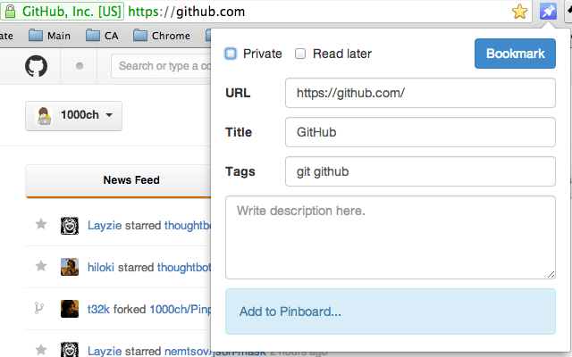
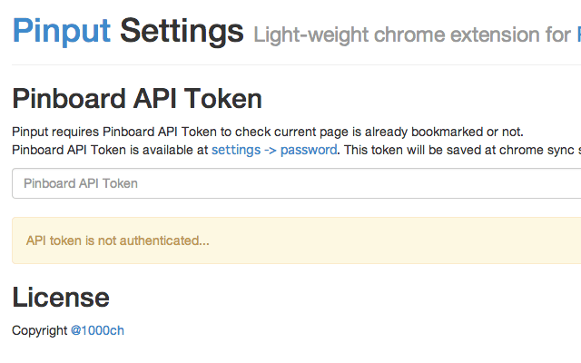

# Pinput 

## About

Light-weight chrome extension for [Pinboard](http://pinboard.in/).

## Usage

Click only!

## Shortcut Key

Press `Ctrl + B` then popup will open.

## Settings

To display whether the current tab is already bookmarked or not at icon,  
set your Pinboard API token at setting page.  
You can open setting page with right click on icon, or from extensions page.  

## License

Copyright 1000ch  

Licensed under the GPL License version 3.  